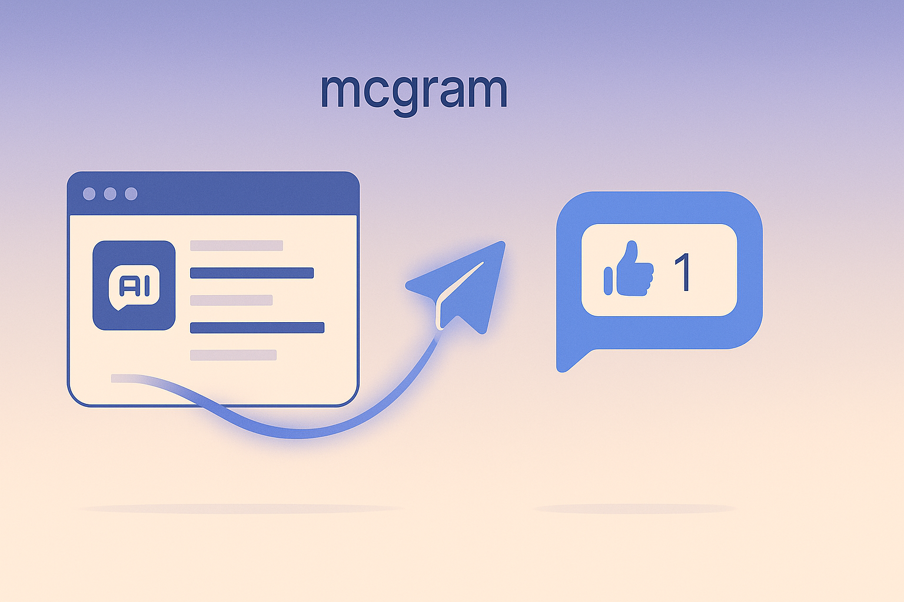
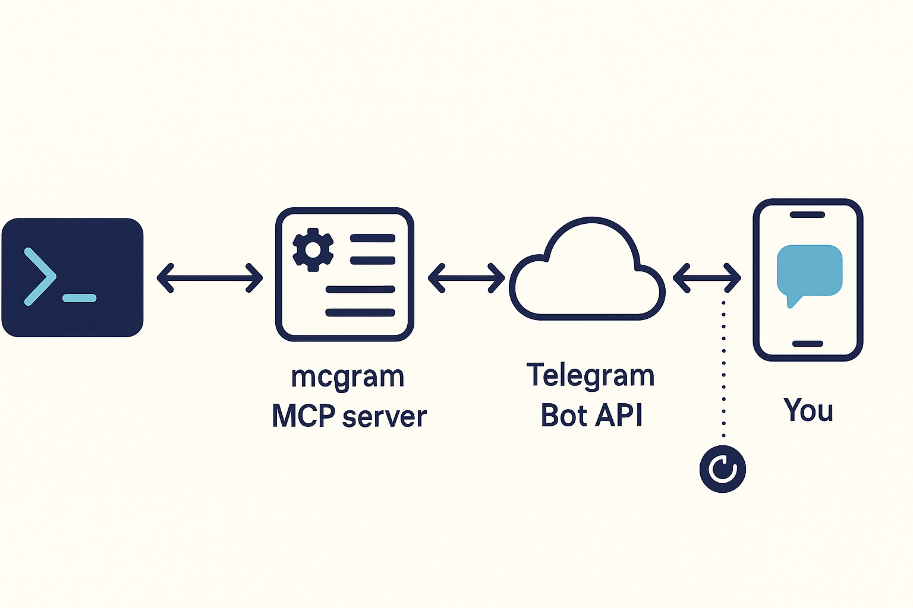

<div align="center">


# mcgram

**Telegram bridge for Claude Code** — Claude can ping you, ask you, and remind you on your personal Telegram bot.

[](https://github.com/tvtdev94/mcgram/actions/workflows/ci.yml)
[](https://pypi.org/project/mcgram/)
[](https://www.python.org/downloads/)
[](LICENSE)
[](#)
[](#)



</div>

---

## What it does

Walk away from a long-running task. mcgram lets Claude **tap you on the shoulder** through Telegram — and lets you tap back.

| | |
|---|---|
| 📣 **Notify** | "Build passed in 3m12s ✅" / send the failing log as attachment |
| ❓ **Ask & wait** | Inline buttons (Approve / Cancel) with a timeout — Claude blocks until you reply |
| ⏰ **Remind** | "nhắc tôi sau 30 phút check container logs" |
| 🎥 **Send video** | Demo recordings play right in-chat (not as a download) |
| 🛰 **Multi-channel** | Route messages to named groups: `oncall`, `bugs`, `team` |

Single process, no daemon, no VPS, no webhook setup. The bot lives inside the MCP server while Claude Code is open.

## How it fits together

<div align="center">

</div>

Claude Code spawns `mcgram` over stdio. mcgram opens a long-poll to the Telegram Bot API. When you tap a button or type a reply, the update lands on your phone-out / mcgram-in side, the operator allowlist filters non-you traffic, and the answer flows back to Claude as the tool result.

## Quickstart

> **Prereqs:** Python 3.11+, [`uv`](https://docs.astral.sh/uv/) or `pipx`, a Telegram account.

```bash
# 1) Install
uv tool install git+https://github.com/tvtdev94/mcgram     # or: pipx install git+https://...

# 2) Scaffold + register MCP + install Claude skill (one command)
mcgram init

# 3) Create a bot with @BotFather → /newbot → copy token
#    Find your chat ID:  /start the bot, then visit
#    https://api.telegram.org/bot<TOKEN>/getUpdates  → copy chat.id

# 4) Paste credentials
#    Edit ~/.mcgram/.env       → MCGRAM_BOT_TOKEN=...
#    Edit ~/.mcgram/config.yaml → operator_chat_id: 123456789

# 5) Verify
mcgram doctor    # ✅ get_me OK, ✅ test message delivered

# 6) Restart Claude Code → /mcp → mcgram appears → done
```

That's it. Now in any Claude Code session: *"báo cho tôi qua Telegram khi xong"* or *"ask me on Telegram before deploying"* — Claude knows what to do.

## The 7 tools

| Tool | When to use | Key inputs |
|---|---|---|
| **`send_message`** | Notify on completion / send a status update | `text`, `channel?`, `silent?` |
| **`send_file`** | Send logs, screenshots, generated artifacts | `path`, `channel?`, `caption?` |
| **`send_video`** | Send a video that **plays in-chat** (mp4/mov/mkv/webm/m4v) | `path`, `channel?`, `caption?` |
| **`ask`** | Question with **inline buttons** OR freetext, blocks until reply or timeout | `question`, `options?`, `timeout_s?`, `channel?` |
| **`set_reminder`** | Schedule an in-process reminder (lost on restart) | `text`, `delay_s`, `channel?` |
| **`cancel_reminder`** | Cancel a pending reminder | `reminder_id` |
| **`list_reminders`** | List currently pending reminders | — |

The companion [Claude Code skill](src/mcgram/data/skill/SKILL.md) (installed by `mcgram init`) teaches Claude when to call which tool — both **English** and **Vietnamese** trigger phrases are recognized.

## Channels

Route messages to different Telegram chats (DMs, groups, topics):

```bash
mcgram channel add oncall -1001234567890 -d "Pager rotation"
mcgram channel add bugs   -1009876543210 -d "Bug triage"
mcgram channel list
#   bugs     chat_id=-1009876543210   Bug triage
#   default  chat_id=796172281        Auto-created from bot.operator_chat_id
#   oncall   chat_id=-1001234567890   Pager rotation
```

Then in Claude Code: *"send the failing log to the bugs channel"* → `send_file(path="…", channel="bugs")`.

## CLI

```bash
mcgram                          # MCP stdio server (Claude Code calls this)
mcgram init [--force]           # scaffold ~/.mcgram/ + skill + auto-register MCP
mcgram doctor                   # config + connectivity check (sends a test message)
mcgram audit [opts]             # analyze audit.jsonl: --since 1h, --tool ask, --rejected, --tail
mcgram channel <action>         # list | add NAME CHAT_ID [-d "desc"] | remove NAME
mcgram install-skill [--force]  # reinstall ~/.claude/skills/mcgram/SKILL.md
```

## Config example

`~/.mcgram/config.yaml`:

```yaml
bot:
  token_env: MCGRAM_BOT_TOKEN      # token loaded from ~/.mcgram/.env
  operator_chat_id: 123456789      # your personal chat ID

defaults:
  parse_mode: plain                # plain | markdown_v2
  ask_timeout_s: 120
  rate_limit_per_min: 20

limits:
  ask_timeout_max_s: 600
  reminder_max_delay_s: 86400      # 24h
  reminder_max_pending: 10
  file_max_bytes: 52428800         # 50 MB
  ask_options_max: 6

channels:                          # optional named destinations
  oncall:
    chat_id: -1001234567890
    description: Pager rotation

audit:
  path: ~/.mcgram/audit.jsonl
  rotate_mb: 25
  redact_text: false               # true → outbound `text` masked in audit
  retention_days: null             # e.g. 14
  timezone: UTC

allow_outside_cwd: false           # send_file restricted to CWD by default
```

## Security model

| Layer | Mitigation |
|---|---|
| 🔐 **Token** | Loaded from env var; never logged; masked in `mcgram doctor` |
| 🚪 **Operator filter** | Non-`operator_chat_id` updates rejected at dispatcher entry — never reach tool handlers |
| 🛡 **`send_file` traversal** | Path resolved + checked against CWD; size capped at `file_max_bytes` |
| ⚡ **Rate limit** | Per-tool token bucket (default 20/min) |
| 🔒 **Single instance** | PID-file lock at `~/.mcgram/.lock`; second `mcgram` exits with `LockHeldError` |
| 📜 **Audit trail** | Every call logged JSONL with `fsync`; survives `kill -9` |
| 🛌 **Reminder spam** | Max 10 pending, 24h delay cap, 1000-char text cap |
| ⏱ **`ask` DoS** | Hard timeout cap (600s) so a forgetful user can't freeze Claude forever |
| 🔁 **Polling conflict** | Telegram 409 caught with clean error — no crash loop |

Full STRIDE analysis: [docs/security-threat-model.md](docs/security-threat-model.md).

## Audit

```bash
mcgram audit                     # summary: counts by status + by tool
mcgram audit --since 1h          # last hour only
mcgram audit --tool send_file    # filter by tool
mcgram audit --rejected          # group rejections by reason
mcgram audit --tail              # follow new entries (Ctrl-C to stop)
```

Sample lines:

```jsonc
{"ts":"2026-05-21T10:00:00+00:00","tool":"send_message","status":"ok","chat_id":123,"channel":"default","text":"build passed","text_len":12,"ms":150}
{"ts":"2026-05-21T10:00:05+00:00","tool":"ask","status":"ok","channel":"oncall","question_id":"q_a1","source":"button","ms":3200}
{"ts":"2026-05-21T10:00:10+00:00","tool":"send_file","status":"rejected","reason":"file_too_large","bytes":62914560}
```

## Known limitations

- **No persistent reminders** — schedules live in process memory. Restart = lost.
- **`ask` blocks the MCP call** — keep timeouts short or Claude waits idle.
- **No remote control** — Claude can send, but the bot doesn't accept arbitrary commands FROM Telegram. (Future v0.2.)
- **No webhook / VPS support** — long-poll only.
- **Same token on 2 machines** → Telegram 409 Conflict (only one poller per bot). Mcgram backs off cleanly; use different bots for different machines.

## Architecture

Full module map, lifecycle diagram, and data flow: [docs/architecture.md](docs/architecture.md).

```
src/mcgram/
├── cli.py · cli_init · cli_doctor · cli_audit · cli_channel · skill_installer
├── config · errors · audit · lock · rate_limiter
├── tg_client · update_dispatcher · polling · server · runtime
├── ask_registry · reminders
└── tools/  send_message · send_file · send_video · ask · set_reminder · cancel_reminder · list_reminders
```

All modules <200 LOC, 153 tests, ruff clean, py3.11/3.12 × ubuntu/windows in CI.

## Update / uninstall

```bash
uv tool upgrade mcgram          # or: pipx upgrade mcgram
mcgram install-skill --force    # refresh bundled Claude skill if changed
claude mcp remove mcgram        # unregister from Claude Code
uv tool uninstall mcgram        # remove binary
rm -rf ~/.mcgram ~/.claude/skills/mcgram   # remove config + skill
```

## Develop

```bash
git clone https://github.com/tvtdev94/mcgram && cd mcgram
uv sync --extra dev
uv run pytest -q
uv run ruff check src/ tests/
```

## Credits

- Patterns mirrored from sister project [dbread](https://github.com/tvtdev94/dbread) (read-only DB MCP).
- Built around the [Model Context Protocol](https://modelcontextprotocol.io/) and the Telegram Bot API.

## License

MIT — see [LICENSE](LICENSE).
