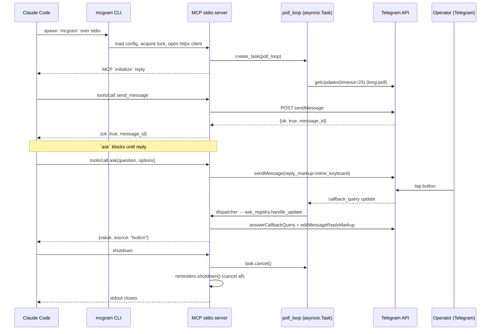

# Architecture

> One process, one bot, one operator chat. Long-poll on the side, MCP stdio in front.

## Module map

```
src/mcgram/
├── cli.py                  # argparse dispatcher (lazy imports for <500ms)
├── cli_init.py             # `mcgram init` — scaffold + install skill
├── cli_doctor.py           # `mcgram doctor` — config + connectivity checks
├── cli_audit.py            # `mcgram audit` — JSONL analyzer
├── server.py               # MCP stdio bootstrap; wires polling + tools
│
├── config.py               # pydantic Settings (YAML + .env)
├── lock.py                 # SingleInstanceLock (PID file, Windows + POSIX)
├── errors.py               # exception hierarchy
├── audit.py                # JSONL writer + rotation + retention + redact
│
├── tg_client.py            # httpx async wrapper around Bot API
├── update_dispatcher.py    # fan-out + operator allowlist
├── polling.py              # long-poll loop with exponential backoff
├── rate_limiter.py         # per-tool token bucket
├── runtime.py              # AppState dataclass
│
├── ask_registry.py         # PendingAsk + button/freetext/timeout resolver
├── reminders.py            # in-process asyncio.Task scheduler
├── skill_installer.py      # bundled Claude skill installer
│
├── tools/
│   ├── send_message.py
│   ├── send_file.py
│   ├── ask.py
│   ├── set_reminder.py
│   ├── cancel_reminder.py
│   └── list_reminders.py
│
└── data/                   # bundled in wheel
    ├── config.example.yaml
    └── skill/SKILL.md
```

Every module is < 200 LOC.

## Lifecycle



## Data flow: an `ask` call

1. Claude Code → `tools/call ask(question="Deploy?", options=["Yes","No"], timeout_s=60)`
2. `tools/ask.py::handle` validates input + acquires a rate-limit token
3. `AskRegistry.open()` posts the question with inline keyboard, registers a `PendingAsk` keyed by `question_id`, awaits its `asyncio.Future` with `asyncio.wait_for(timeout_s)`
4. Operator taps a button → Telegram sends `callback_query` → polling loop receives it → `from_operator` filter passes (chat matches `operator_chat_id`) → dispatcher calls `AskRegistry.handle_update`
5. Handler looks up `q_<id>`, calls `future.set_result((value, "button"))`, sends `answerCallbackQuery` to clear the spinner
6. `asyncio.wait_for` resolves, registry edits the message to strip the keyboard, returns `{value, source: "button", question_id}`
7. Audit log gets `{tool:"ask", status:"ok", source:"button", ms_to_resolve}`
8. Claude Code receives the structured response

## Data flow: `send_file`

1. `tools/send_file.py::handle` resolves path, rejects if non-existent / not regular file / size > cap / outside CWD (unless `allow_outside_cwd`)
2. Rate-limit token
3. `httpx` multipart POST to `sendDocument`
4. Audit `{tool:"send_file", status:"ok", bytes, ms, message_id}`

## Operator filter

Every incoming update is checked at the dispatcher layer (`update_dispatcher.from_operator`). Non-operator updates are dropped + audited as `{tool:"_polling", status:"rejected", reason:"non_operator"}`. Tool handlers never see them.

This is the only line of defence against someone messaging the bot directly — Telegram bots have no built-in restriction. Keep `operator_chat_id` private and the bot's username unpublished.

## Polling resilience

Exponential backoff on errors: `1s → 2s → 4s → … → 30s`. Reset to `1s` on the first successful response. Errors are logged to audit as `{tool:"_polling", status:"error", error:str}`. The loop runs until `task.cancel()` (server shutdown).

## Reminder scheduler

Pure `asyncio.create_task(asyncio.sleep(delay) → send_message(⏰ text))`. Stored in two parallel dicts (`_tasks`, `_meta`) keyed by `r_<hex>`. On shutdown all tasks are cancelled — fires-in-flight catch `CancelledError` and emit a `_reminder_fire status:cancelled` audit line. State is in-process only; no SQLite, no persistence.

## What lives outside this repo

- `~/.mcgram/config.yaml` — user config
- `~/.mcgram/.env` — bot token
- `~/.mcgram/.lock` — single-instance PID file
- `~/.mcgram/audit.jsonl[.1..3]` — append-only audit log + rotated backups
- `~/.claude/skills/mcgram/SKILL.md` — companion skill, installed by `mcgram init`
